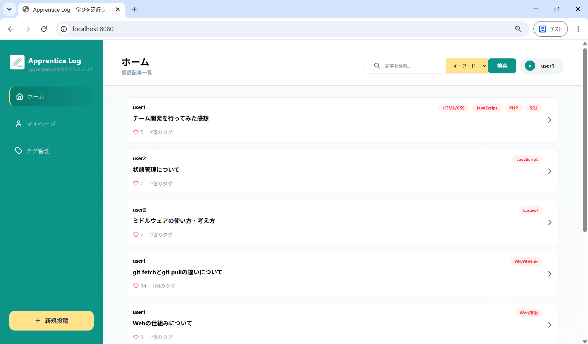
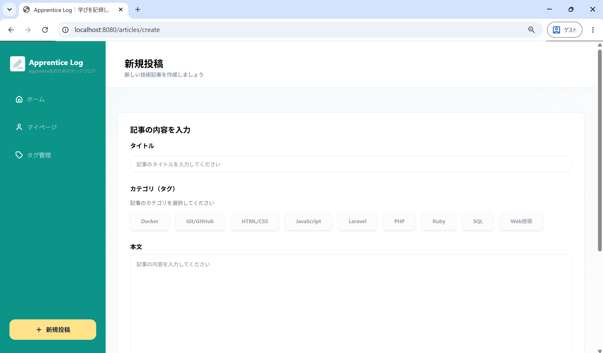
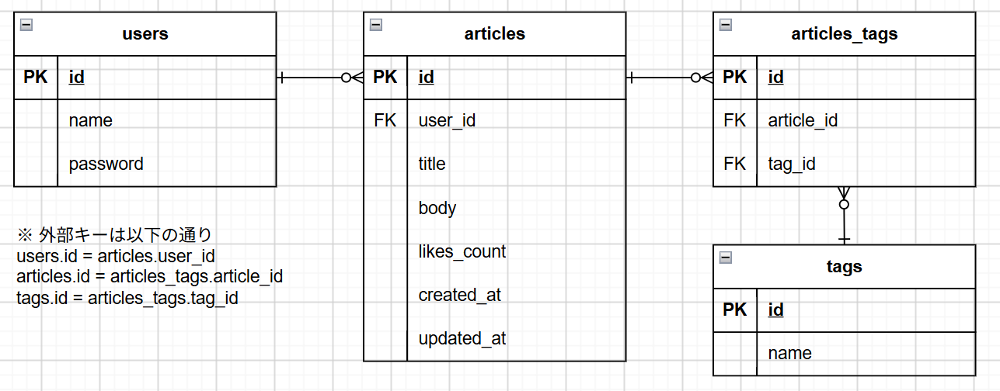

# 学習記録アプリ

## 目次
1. [概要](#1-概要)
2. [背景](#2-背景)
   - [学習内容を忘れてしまう](#-学習内容を忘れてしまう)
   - [学習が個人で止まっている](#-学習が個人で止まっている)
3. [DB設計](#3-db設計)
4. [開発スケジュール](#4-開発スケジュール)
5. [環境構築方法](#5-環境構築方法)
   - [ソースコードの取り込み](#-ソースコードの取り込み)
   - [Docker構築](#-docker構築)
   - [テーブル作成と初期データセット](#-テーブル作成と初期データセット)
 
## 1. 概要
アプレンティスカリキュラムの１つである「チーム開発」の成果物になります。  
（ハッカソンのような形でアイディア出し・要件定義から実装まで一気通貫で開発を行いました）  
今回は日々の学習記録をブログ形式で簡単に作成・共有できるアプリを開発しました。

↓ トップページの様子


↓ 記事投稿ページの様子


## 2. 背景
今回、学習記録アプリを開発した背景は主に以下の2点です。
#### ① 学習内容を忘れてしまう
プログラミング学習は勉強すべき内容が膨大なこともあり、せっかく頑張って勉強しても別の単元の勉強を始めると忘れてしまう...ということが課題に上がりました。

さらに、なぜ忘れてしまうのか？と深ぼっていくと

- 学習が表面的な理解でとどまっている
- 学習の振り返りが大変で復習しづらい
- インプット学習が中心になっている

といった要因が見えてきました。
学んだことを自分でアウトプットする機会を創出＆過去の学習記録を簡単に見返せるアプリを作ることでこういった課題を解決できると考えました。

#### ② 学習が個人で止まっている
アプレンティスはエンジニアを目指すプログラミング未経験・初学者のコミュニティなのですが、学習が個々で閉じておりもったいないという意見も上がりました。

プログラミング学習は挫折率が高いことで有名ですが、こういった初学者の学習コミュニティをつなぐアプリを作ることで、初学者特有のつまづきポイントなどもお互いに共有でき、学習リタイアを防げるのでは？と考えました。

※ Qiitaは初心者からベテランエンジニアまで幅広い人が記事を書きますが、今回作るアプリは対象を初学者に絞ることで差別化を図りました

こういった経緯から初学者が学習内容を投稿・共有できるアプリの作成を行いました。

## 3. DB設計


## 4. 開発スケジュール
| 取組期間 | 内容 |
| ---- | ---- |
| 7/23(土) - 8/2(日) | アイデア決め |
| 8/3(月) - 8/23(日) | 要件定義 |
| 8/24(月) - 8/30(日) | 設計・タスク出し、ワイヤフレーム作成 |
| 8/31(月) - 9/9(水) | ワイヤフレームすり合わせ、環境構築 |
| 9/10(木) - 9/20(日) | コーディング・実装 |
| 9/20(日) | プレゼン発表・振り返り |

## 5. 環境構築方法
ローカル環境でアプリを動作させる上で必要な手順を紹介します。

#### ① ソースコードの取り込み
以下コマンドでGitHubから手元PCへソースコードを取り込みます。
```bash
git clone https://github.com/yoshidasyoki/team_project.git
```

取り込みが完了したら`team_project`ディレクトリ内へアクセスします。
```bash
cd team_project
```

`ls`コマンドで確認を行い、以下のようなファイルが表示されれば取り込み操作は完了になります。
↓ 実行結果
```
README.md  compose.yml  docker  docs  imgs  src
```

#### ② Docker構築
次にDockerを用いてイメージのビルドとコンテナの作成・起動を行います。  
以下コマンドで実行することができます。
```bash
docker compose up -d
```

起動完了後、以下コマンドを実行してコンテナの起動状態を確認します。  
```bash
docker compose ps
```

以下のように`db`と`web`コンテナが表示されればこちらのタスクは完了になります。

```bash
NAME                 IMAGE              COMMAND                  SERVICE   CREATED      STATUS         PORTS
team_project-db-1    team_project-db    "docker-entrypoint.s…"   db        4 days ago   Up 3 seconds   0.0.0.0:53306->3306/tcp, [::]:53306->3306/tcp
team_project-web-1   team_project-web   "docker-php-entrypoi…"   web       4 days ago   Up 3 seconds   0.0.0.0:8080->80/tcp, [::]:8080->80/tcp
```

> [!WARNING]
> ポート番号の競合でコンテナが正常に立ち上がらない場合があります。その場合は以下手順にて対応を行うようにしてください。  
> #### 1. ポート番号の変更  
> `compose.yml`の`ports`項目を変更します。例えばポート番号53306が競合したため3306に変更する場合は
> ```yml
> services:
> # （一部省略）
>  db:
>    ports:
>      - 3306:3306    # - 53306:3306から変更
> ```
> とすることで変更可能です。  
> #### 2. 再ビルド   
> `compose.yml`に変更を加えた場合は再ビルドが必要になります。下記コマンドを順番に実行してコンテナの再起動までを行います。
> ```bash
> docker compose down    # コンテナ停止＆関連リソース削除
> ```
> ```bash
> docker compose build   # イメージの作成
> ```
> ```bash
> docker compose up -d   # コンテナの作成・起動
> ```
> 問題なく起動まで完了すればこちらは大丈夫です。

#### ③ テーブル作成と初期データセット
現状ではまだアプリは動作しませんので、初期設定を行っていきます。  
以下コマンドを順に実行することでセットアップを行うことができます。

```bash
docker compose exec web bash   # webコンテナ内に入る
```

```bash
php database/create.php       # DBテーブルの作成
```
※ 処理に成功すると「テーブルを作成しました」と表示されます

```bash
php database/initData.php     # タグデータの登録
```
※ 処理に成功すると「データを作成しました」と表示されます

以上のコマンドを実行できたらセットアップは完了になります。ブラウザを開き以下URLにアクセスを行い、新規登録画面が表示されればこちらのタスクは完了になります。
（以降はユーザ登録の上、アプリをご利用いただけます）
```
localhost:8080/users/create
```

> [!WARNING]
> コマンド実行時にエラーが表示された場合は以下の手順で対応を行い、再度環境構築から行うようお願いいたします。
> 以下コマンドを順番に実行し、イメージ・コンテナの再生成を行います。
> ```bash
> docker compose down -v           # コンテナと関連リソースをボリューム込みで削除
> ```
> ```bash
> docker compose build --no-cache  # イメージをキャッシュなしで生成
> ```
> ```bash
> docker compose up -d             # コンテナ作成・起動
> ```
> ここまでを行い、コンテナが無事に起動すればDockerの再構築は完了です。  
> 以降は`③ テーブル作成と初期データセット`の手順を再度実施していただくようお願いいたします。
