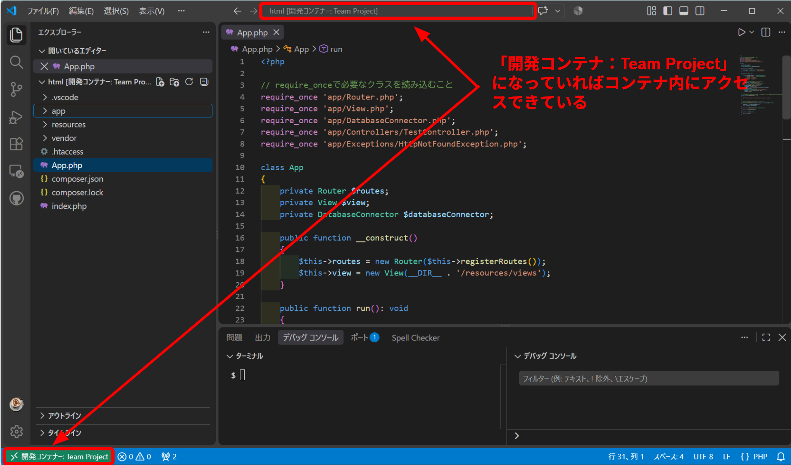
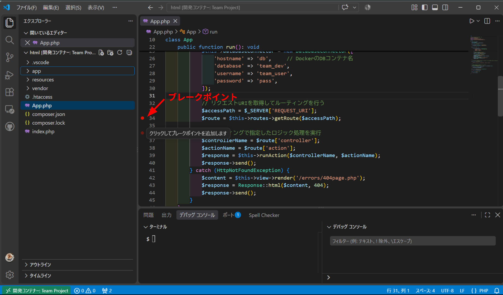
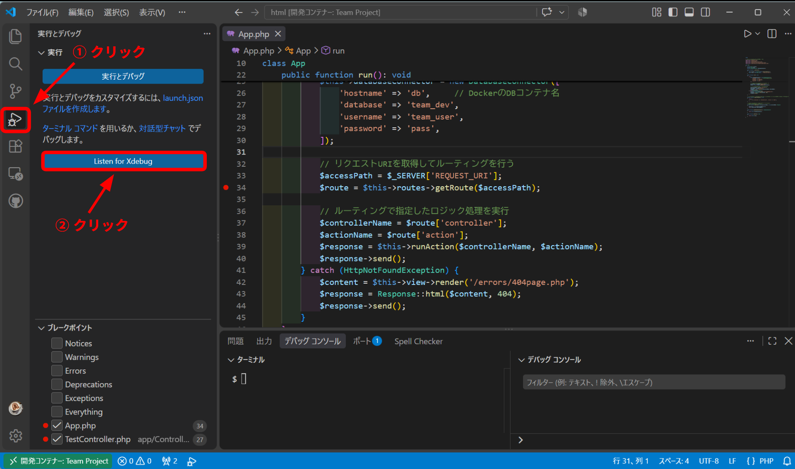
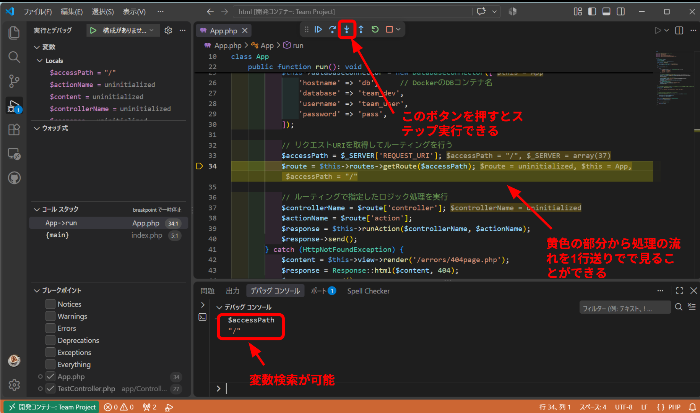
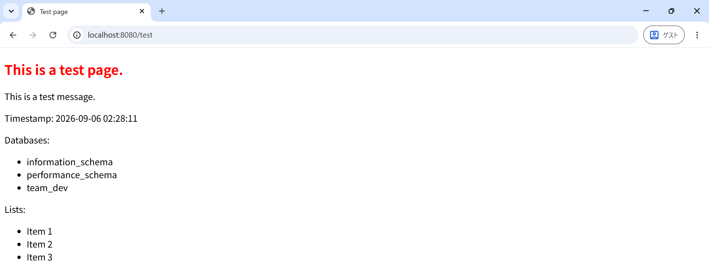

# アプリのベース部分の紹介（初期状態）
## 概要
今回開発を行うアプリのベース部分を作成したので、構成と簡単な開発フローについて紹介していきます。

## 目次
### [1. 環境構築の方法](#1-環境構築の方法)  
- [ソースコードのクローン](#ソースコードのクローン)
- [イメージとコンテナの作成・起動](#イメージとコンテナの作成起動)  
- [アクセス確認](#アクセス確認)

### [2. 開発時の操作方法](#2-開発時の操作方法)
- [MySQLの操作方法](#mysqlの操作方法)
- [PHPの操作方法](#phpの操作方法)

### [3. 処理の流れ](#3-処理の流れ)

### [4. ハンズオン紹介](#4-ハンズオン紹介)
- [ルーティングの設定](#ルーティングの設定)
- [コントローラ・アクションの設定](#コントローラアクションの設定)
- [DB接続](#db接続)
- [PHP処理のHTMLへの埋め込み・レンダリング](#php処理のhtmlへの埋め込みレンダリング)

## 1. 環境構築の方法
最初に開発環境を構築する方法を紹介します。  
今回はDockerを用いているのでgit上からソースコードをクローンしたのち、イメージとコンテナの作成・起動を行う流れになります。

### ソースコードのクローン
お手元PCの任意の場所へ移動し、GitHub上からソースコードをローカル環境へ取り込みます。クローンは以下のコマンドで取り込むことができます。

```bash
git clone https://github.com/yoshidasyoki/team_project.git
```

コマンドを実行すると`team_project`というディレクトリが読み込まれるので`cd`コマンドで中に入ります。`ls`コマンドで確認すると以下のようなディレクトリ・ファイル構成になっていると思います。

```bash
compose.yml  docker  docs  src
```

### イメージとコンテナの作成・起動
ここまでできたら次にDockerイメージとコンテナの作成・起動を行います。  
`compose.yml`と同階層にいる状態で以下コマンドを実行することでイメージの作成を行います。
```bash
docker compose build
```

しばらくしてイメージが作成されたらコンテナの作成・起動を以下コマンドで行います。
```bash
docker compose up -d
```

コンテナも無事起動できたら前準備は完了です。  
※ 念のためコンテナの起動状況を確認しておきましょう。以下コマンドを実行して`web`、`db`コンテナが両方動いていればOKです。
↓ 確認コマンド
```bash
docker compose ps
```

↓ 実行結果（`web`、`db`コンテナがともにこのように表示されればOK）
```bash
NAME                 IMAGE              COMMAND                  SERVICE   CREATED      STATUS             PORTS
team-project-db-1    mysql:8.4          "docker-entrypoint.s…"   db        2 days ago   Up About an hour   0.0.0.0:3306->3306/tcp, [::]:3306->3306/tcp
team-project-web-1   team-project-web   "docker-php-entrypoi…"   web       2 days ago   Up About an hour   0.0.0.0:8080->80/tcp, [::]:8080->80/tcp
```

### アクセス確認
ここまでで環境構築の一連のプロセスは完了になりますが、ちゃんとブラウザにアクセスしたときにページが表示されるかも確認してみましょう。

ブラウザから以下URLにアクセスするとトップページが表示されます。
```bash
http://localhost:8080/
```
↓ 表示されるページ


これで無事表示されれば環境構築は完了になります。

## 2. 開発時の操作方法
開発時のPHP、およびMySQLの操作方法について簡単に説明します。

### MySQLの操作方法
MySQLをターミナル上で操作するには`db`コンテナに入った状態でMySQLにログインする必要があります。  
`compose.yml`と同階層で以下コマンドを実行し、まずは`db`コンテナ内に入ります。
```bash
docker compose exec db bash
```

コンテナ内に入ったら続けて以下コマンドを実行してMySQLへログインします。  
※ 以下のコマンドで使用するデータベースも指定しています。
```bash
mysql -u${MYSQL_USER} -p${MYSQL_PASSWORD} -D${MYSQL_DATABASE}
```

無事にログインが成功したら、後はターミナル上でSQL文を実行することでDB操作を行うことができます。

### PHPの操作方法
PHPの場合はMySQLと異なりコンテナ内にアクセスしなくても開発を行うことができます。ただしデバッグ機能を使いたい場合はコンテナ内で開発を行う必要があるので、デバッグ方法も交えて説明します。

まずは`compose.yml`と同階層の位置で以下コマンドを実行してVSCodeを開きます。
```bash
code .
```

以下のような画面が開くので、  
① 左下の緑バー部分をクリック  
② 「コンテナを再度開く」をクリック  
します。


するとリモート接続が開始され、少し待つと以下のような画面が開きます。  
（初回は結構時間がかかる場合があります）



これでコンテナ内へリモート接続ができたのでコーディングはもちろん、デバッグも行うことができるようになります。

デバッグを行う際には、最初にデバッグしたいところにブレークポイントを設置します。


次に下図のボタンをクリックしてデバッグモードを開始します。


この状態でブラウザからURLでアクセスすると指定の箇所でブレークポイントが止まり、ステップ実行で動作を確認することができます。


## 3. 処理の流れ
次に、URLをブラウザ上でたたいてからバックエンド側で処理を行い、ブラウザ上にその結果を表示させる一連の処理の流れを説明していきます。

今回は大まかな流れとして以下のようにベース部分を設計・作成しています。


ブラウザからURLアクセスを受けると以下のように処理が実行されていきます。
1. ルーティング
最初に`App`クラスへリクエストが来るので、ルーティングを実施します。  
ルーティングとはアクセスパスとロジック処理を紐づける処理のことです。例えば`/home`でアクセスが来たら記事一覧を取得しよう！と呼び出す処理を決めていくのがルーティングです。

2. アプリロジックの実行
ルーティングにより実行する処理が決まったら実際にロジック部分の実行をします。  
（Controller層でリソースに対する諸々の処理を制御するイメージです）  
例えば記事一覧を取得する際に、実際にDBに接続してデータを取得するという処理がここに該当します。

3. HTMLの生成
ロジック処理の結果をもとに、レスポンス用HTMLの生成を行います。  
※ リダイレクト処理を行う場合はこの工程はスキップされます

4. HTTPレスポンス生成・送信
最後にHTTPレスポンスの生成を行います。ここでステータスコードやレスポンスデータの型式などの設定を行います。そしてブラウザへレスポンスの送信を行います。
ブラウザ側でレスポンスを受け取ると、HTMLを解析してレンダリングを行います。こうしてユーザへページが表示されます。

## 4. ハンズオン紹介
ここまででロジックの流れを見てきましたが、よりイメージを深めてもらうために実際に簡単なページの表示をハンズオン形式で紹介していきます。

`http://localhost:8080/test`にアクセスすると以下のようなページが表示される、という処理を実装してきます。


なお、今回のハンズオンでは以下の内容について扱っていきます。
- ルーティングの設定
- コントローラ・アクションの設定
- DB接続・クエリの実行
- PHP処理のHTMLへの埋め込み・レンダリング
- HTTPレスポンス（ステータスコード、リダイレクト処理等）

> [!NOTE]
> ここから先の操作はwebコンテナ内に入った状態で操作を行うことをおすすめします  
>（トラブル時にもデバッグ操作で原因追及が簡単に行えるため）

### ルーティングの設定
ルーティングの設定は`App.php`の以下の場所で行います。
```php
private function registerRoutes(): array
{
    return [
        '/' => ['controller' => 'TestController', 'action' => 'index'],
        '/test' => ['controller' => 'TestController', 'action' => 'test'],  // この行を追加
    ];
}
```
`/test`のパスでアクセスが来ると`TestController`の`test`アクションを実行する、という設定をここでは行っています。これでルーティングは完了になります。

### コントローラ・アクションの設定
ルーティングされた先、つまりリクエストにより呼び出される側の処理を次は定義していきます。  
`app/Controllers`ディレクトリの`TestController.php`を開き、`test`というアクション（メソッド）を作成します。

```php
class TestController extends Controller
{
    public function index(): Response
    {
        $content = $this->render('/test/index.php');
        return Response::html($content);
    }

    // ここを追加
    public function test(): Response {}
}
```

> [!WARNING]
> 新しくコントローラを作成する場合は以下の2行を先頭に加えるようにしてください。
> ```php
> require_once 'app/Controllers/Controller.php';
> require_once 'app/Response.php';
> ```

アクションを用意したらロジック処理を実際に書いていきます。  
今回はDB操作も交えながら紹介していこうと思います。

### DB接続
`test`メソッドを以下のように書くことでDB接続・操作を行うことができます。
```php
public function test(): Response
{
    $sql = 'SHOW DATABASES';                        // データベース一覧を検索するクエリ
    $stmt = $this->dbh->query($sql);                // クエリの実行
    $databases = $stmt->fetchAll(PDO::FETCH_ASSOC); // 取得結果を配列に変換
}
```

> [!NOTE]
> DB接続には`PDO`インスタンスが必要となりますが、この処理については既にコーディング済です。  
> `$this->dbh`に格納されているのでこれを呼び出せばDB操作を行うことができます。  
> 詳細な使用方法はPHPドキュメント（PDO）等を参照ください。

実際のロジックではもう少し処理が複雑になると思いますが、基本的な操作は変わりません。
- `$this->dbh`（`PDO`インスタンス）を呼び出す
- 専用メソッド（今回は`query`を使用したが`prepare`等別メソッドもあり）を使用してクエリを実行する
- 結果を配列等で取得する
という流れでPHP⇄MySQLの処理を実装していきます。

### PHP処理のHTMLへの埋め込み・レンダリング
PHPで取得した情報をHTMLに埋め込んでレンダリングする方法をここでは紹介します。  
先に`test`アクションの完成コードをお見せすると以下のような形になります。

```php
public function test(): Response
{
    // DB接続・操作
    $stmt = $this->dbh->query('SHOW DATABASES');
    $databases = $stmt->fetchAll(PDO::FETCH_ASSOC);

    // ① 埋め込むデータを設定
    $variables = [
        'message' => 'This is a test message.',
        'timestamp' => date('Y-m-d H:i:s'),
        'databases' => $databases,
        'lists' => ['Item 1', 'Item 2', 'Item 3'],
    ];

    // ② レンダリング処理の実装
    $content = $this->render('/test/test.php', $variables);

    // ③ HTTPレスポンスの設定
    return Response::html($content, 200);
}
```

順に説明していきます。

#### ① 埋め込むデータを設定
まず、HTMLファイルに埋め込めたいデータを`$variables`という配列の中に記述します。  
今回はレンダリングの様子を把握していただく目的で`$databases`以外にもいくつか項目を設定してみました。

#### ② レンダリング処理の設定
今回の要であるレンダリング処理の設定方法を説明していきます。  
HTMLファイルの生成に際しては`$this->render`メソッドを用いて行います。
引数についてですが、

- 第一引数：
生成したいHTMLを定義したphpファイルのパスを定義します。  
今回の開発環境では`resources/views`内に配置されるphpファイルをレンダリング対象とするよう予めコーディングを行っているので、`resources/views`以下のパスを指定します。

- 第二引数：
埋め込みたいPHPデータ（配列形式である必要あり）を設定します。  
※ 埋め込みたいデータがない場合は第一引数のみ設定するようにしてください。

という形で設定を行います。

今回の場合は
```php
$this->render('/test/test.php', $variables);
```
としているので、`resources/views`ディレクトリ内の`test/test.php`というファイルの内容をもとにHTMLを生成する、そしてその際に`$variables`内に定義した値を使用する、と設定していることになります。

生成するHTMLファイルの定義が必要なので、そちらも行っていきましょう。  
`test`アクションの結果を表示させるためのファイル`test.php`を`resources/views/test/test.php`に新規作成します。そして`test.php`を以下のように記述します。

```php
<?php

/** @var string $message */
/** @var string $timestamp */
/** @var array $databases */
/** @var array $lists */
?>

<!DOCTYPE html>
<html lang="ja">

<head>
    <meta charset="UTF-8">
    <meta name="viewport" content="width=device-width, initial-scale=1.0">
    <link rel="stylesheet" href="resources/css/test/test.css">
    <title>Test page</title>
</head>

<body>
    <h2>This is a test page.</h2>
    <p><?php echo $message; ?></p>
    <p>Timestamp: <?php echo $timestamp; ?></p>
    <p>Databases:</p>
    <ul>
        <?php foreach ($databases as $db): ?>
            <li><?php echo $db['Database']; ?></li>
        <?php endforeach; ?>
    </ul>

    <p>Lists:</p>
    <ul>
        <?php foreach ($lists as $item): ?>
            <li><?php echo $item; ?></li>
        <?php endforeach; ?>
    </ul>
</body>

</html>
```

こちらも簡単に説明していきます（PHPはHTML文の中に埋め込んで使用できるこをを念頭に見ていってください）  
今回は`$message`や`$timestamp`のようにHTML内に変数が登場していますが、この変数に`test`アクションの結果が埋め込まれているイメージです。
`TestController`の`test`アクションで、
```php
$variables = [
    'message' => 'This is a test message.',
    'timestamp' => date('Y-m-d H:i:s'),
    'databases' => $databases,
    'lists' => ['Item 1', 'Item 2', 'Item 3'],
];
```
と設定したと思いますが、HTML側では`$variables`のキーが変数名、値が変数の格納値として扱われるようになっています。

例えば、
```php
$variables = [
    'message' => 'This is a test message.'
];
```
という箇所に対しては、

```php
$message = 'This is a test message.';
```
というように`$variables`が変数展開されてHTML側に渡されるというわけです。

埋め込みのところも見てみましょう。  
例えば`$message`の内容をpタグで表示させたい！とします。この時は`$message`はPHPの変数であると示す必要があるので、
```php
<p><?php echo $message; ?></p>
```
とphpタグで囲んであげる必要があります。

なお、`$lists`のような配列形式を表示させるときは通常のPHPと同様に`foreach`で記述を行います。
```php
<ul>
    <?php foreach ($lists as $item): ?>
        <li><?php echo $item; ?></li>
    <?php endforeach; ?>
</ul>
```
ただし見ていただければわかる通り、PHPでの書き方と少し異なるので注意が必要です。

なお冒頭に、
```php
<?php
/** @var string $message */
/** @var string $timestamp */
/** @var array $databases */
/** @var array $lists */
?>
```
と記載していますがこれはあってもなくても動作には影響しません。  
※ これをつけないとVSCodeエディタ側で赤い波々が出てしまうので消す目的で定義しています。

ここまででHTMLの記述は完了になりますが、この状態ではまだCSSが当たらないのでその設定も行っていきます。  
CSSファイルは`resources/css`内に配置を行います。今回は`resources/css/test/test.css`の場所に新規にファイルの作成してスタイル当てを行います。

簡易的にCSSの当て方を紹介したいので、`test.css`の中身は以下のように設定します。
```css
h2 {
  color: red
}
```

こうすることでh2タグ部分が赤文字で表示されるようになります。  
CSSの読み込みは`resources/views/test/test.php`ファイルの

```html
<link rel="stylesheet" href="resources/css/test/test.css">
```
の箇所で行っています。  
これでHTML生成の部分までは完了になります。

#### ③ HTTPレスポンスの設定
HTTPレスポンスについては`Response::html`メソッドを使用することで簡単に定義できるよう予め実装を行っています。以下のような形で使用します。
```php
Response::html($content, 200);
```

引数については、

- 第一引数：
HTTPレスポンスのボディ部分に格納したいデータ（HTML形式である必要あり）を定義します。今回の例では②で生成したHTML文を格納するよう設定しています。
- 第二引数：
ステータスコードを設定することができます。デフォルトでは200番が返るようになっているので今回の場合は第二引数は省略しても構いません。

というような形で使用します。なおこの段階ではHTTPレスポンスの組み立て準備を行っているだけで、実際にブラウザへ送信されるわけではないのでご注意ください。

> [!NOTE]
> なお、リダイレクトを行いたい場合は
> ```php
> Response::redirect('/');
> ```
> とリダイレクトURLを引数にすることで実装することができます。

この状態で`http://localhost:8080/test`にブラウザからアクセスすると、ハンズオン紹介の冒頭でお見せしたようなページが表示されると思います。  
このような手順でレンダリングを行うことができます。
