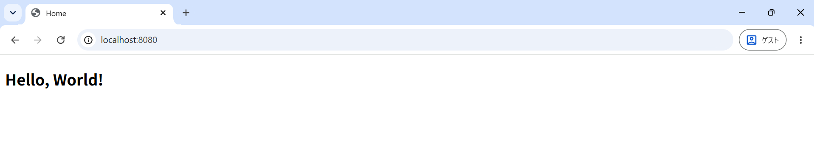
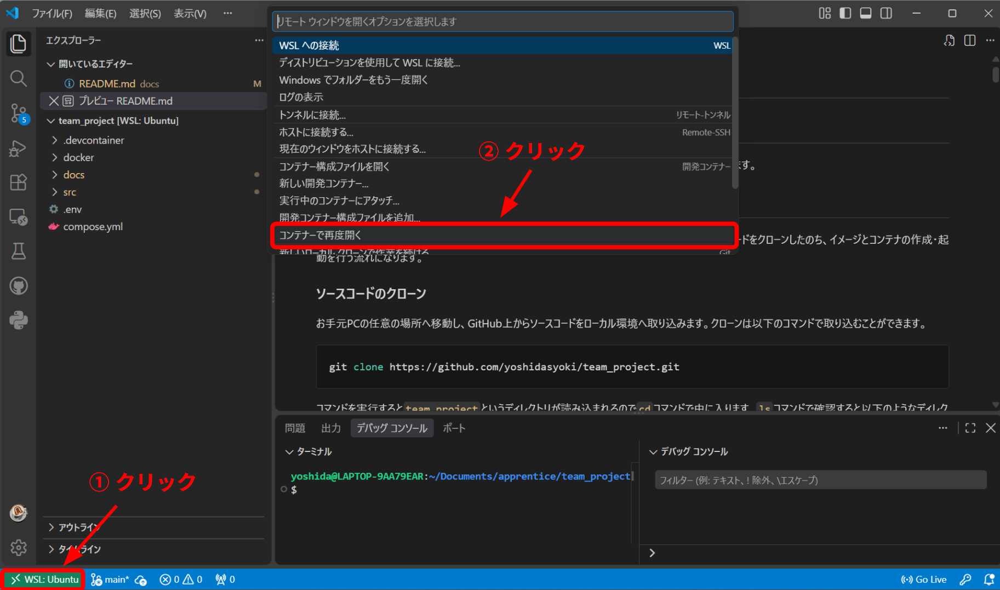
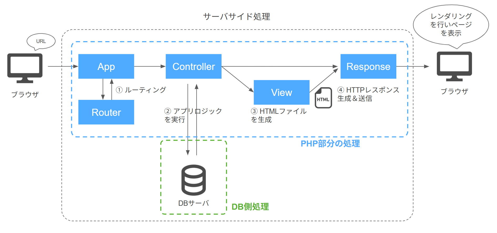

# アプリのベース部分の紹介（初期状態）
## 概要
今回開発を行うアプリのベース部分を作成したので、構成と簡単な開発フローについて紹介していきます。

## 目次
### [1. 環境構築の方法](#1-環境構築の方法-1)
- [ソースコードのクローン](#ソースコードのクローン)
- [イメージとコンテナの作成・起動](#イメージとコンテナの作成起動)
- [アクセス確認](#アクセス確認)

### [2. 開発時の操作方法](#2-開発時の操作方法-1)
- [MySQLの操作方法](#mysqlの操作方法)
- [PHPの操作方法](#phpの操作方法)

### [3. 処理の流れ](#3-処理の流れ-1)

## 1. 環境構築の方法
最初に開発環境を構築する方法を紹介します。
今回はDockerを用いているのでgit上からソースコードをクローンしたのち、イメージとコンテナの作成・起動を行う流れになります。

### ソースコードのクローン
お手元PCの任意の場所へ移動し、GitHub上からソースコードをローカル環境へ取り込みます。クローンは以下のコマンドで取り込むことができます。

```bash
git clone https://github.com/yoshidasyoki/team_project.git
```

コマンドを実行すると`team_project`というディレクトリが読み込まれるので`cd`コマンドで中に入ります。`ls`コマンドで確認すると以下のようなディレクトリ・ファイル構成になっていると思います。

```bash
compose.yml  docker  docs  src
```

### イメージとコンテナの作成・起動
ここまでできたら次にDockerイメージとコンテナの作成・起動を行います。
`compose.yml`と同階層にいる状態で以下コマンドを実行することでイメージの作成を行います。
```bash
docker compose build
```

しばらくしてイメージが作成されたらコンテナの作成・起動を以下コマンドで行います。
```bash
docker compose up -d
```

コンテナも無事起動できたら前準備は完了です。
※ 念のためコンテナの起動状況を確認しておきましょう。以下コマンドを実行して`web`、`db`コンテナが両方動いていればOKです。
↓ 確認コマンド
```bash
docker compose ps
```

↓ 実行結果（`web`、`db`コンテナがともにこのように表示されればOK）
```bash
NAME                 IMAGE              COMMAND                  SERVICE   CREATED      STATUS             PORTS
team-project-db-1    mysql:8.4          "docker-entrypoint.s…"   db        2 days ago   Up About an hour   0.0.0.0:3306->3306/tcp, [::]:3306->3306/tcp
team-project-web-1   team-project-web   "docker-php-entrypoi…"   web       2 days ago   Up About an hour   0.0.0.0:8080->80/tcp, [::]:8080->80/tcp
```

### アクセス確認
ここまでで環境構築の一連のプロセスは完了になりますが、ちゃんとブラウザにアクセスしたときにページが表示されるかも確認してみましょう。

ブラウザから以下URLにアクセスするとトップページが表示されます。
```bash
http://localhost:8080/
```
↓ 表示されるページ


これで無事表示されれば環境構築は完了になります。

## 2. 開発時の操作方法
Dockerコマンド、および開発時のPHP・MySQLの操作方法について簡単に説明します。

### Dockerコマンドの紹介
ここでは、今回のアプリ開発で使用しそうなDockerコマンドを事例に合わせて紹介していきます。
※ 以下で紹介するコマンドはすべて`compose.yml`と同階層の位置で実行するようにしてください

#### イメージ作成
イメージの作成は以下コマンドで実行を行います。
```bash
docker compose build
```

もしくは以下のコマンドを用いるとイメージに加えてコンテナの作成・起動までを一括で行うことができます。
```bash
docker compose up -d
```

なおイメージのビルドは環境構築の内容を変更した場合にも実行する必要がありますが、今回のチーム開発ではこのパターンは少ないと思われます。とりあえずはGitHubからソースコードをクローンしてきたときにイメージの作成が必要になる、くらいの理解で大丈夫です。

#### コンテナの作成・起動
イメージが作成できたら、次にコンテナの作成・起動を以下のコマンドで行います。
```bash
docker compose up -d
```

このコマンドが開発を行う上で最も頻繁に用いるコマンドだと思います。PCの電源を切ったりするとコンテナが自動的に停止するので、最初にこのコマンドを実行して開発を始めていくという流れになります。

#### コンテナの停止
PCの電源を切れば自動でコンテナは止まりますが、意図的に止めたい場合は以下のコマンドを用います。
```bash
docker compose stop
```

このコマンドも場面によっては使うことになると思うので覚えてもらえると良いと思います。

#### イメージの再ビルド
Dockerを用いて開発を行っていると、コンテナで使用するポート番号が既に使用されていてコンテナが起動しないという場面が出てくるかもしれません。
そういった場合は最初に以下のコマンドでコンテナの削除を行います。
```bash
docker compose down
```

次に以下コマンドを実行すると再ビルドすることができます。
```bash
docker compose build
```

なお、キャッシュを用いずに再ビルドしたい場合は以下コマンドを用います。
```bash
docker compose build --no-cache
```

おそらく、今回の開発ではイメージの再ビルドが必要になる場面はほぼないので頭の片隅に入れてもらえれば大丈夫です。

#### Dockerコマンドまとめ
ここまでDockerコマンドについて解説してきましたが、概ね今回の開発で使用するのは以下のコマンドになると思います。

イメージビルド（GitHubからクローン時に実装）
```bash
docker compose build
```

コンテナ作成及び起動（開発を行う際に毎回実行する）
```bash
docker compose up -d
```

コンテナ停止（ポート番号使用不可のエラーが出た時にまず試す）
```bash
docker compose stop
```

### MySQLの操作方法
MySQLをターミナル上で操作するには`db`コンテナに入った状態でMySQLにログインする必要があります。
`compose.yml`と同階層で以下コマンドを実行し、まずは`db`コンテナ内に入ります。
```bash
docker compose exec db bash
```

コンテナ内に入ったら続けて以下コマンドを実行してMySQLへログインします。
※ 以下のコマンドで使用するデータベースも指定しています。
```bash
mysql -u${MYSQL_USER} -p${MYSQL_PASSWORD} -D${MYSQL_DATABASE}
```

無事にログインが成功したら、後はターミナル上でSQL文を実行することでDB操作を行うことができます。

### PHPの操作方法
PHPの場合はMySQLと異なりコンテナ内にアクセスしなくても開発を行うことができます。ただしデバッグ機能を使いたい場合はコンテナ内で開発を行う必要があるので、デバッグ方法も交えて説明します。

まずは`compose.yml`と同階層の位置で以下コマンドを実行してVSCodeを開きます。
```bash
code .
```

以下のような画面が開くので、
① 左下の緑バー部分をクリック
② 「コンテナを再度開く」をクリック
します。



するとリモート接続が開始され、少し待つと以下のような画面が開きます。
（初回は結構時間がかかる場合があります）


これでコンテナ内へリモート接続ができたのでコーディングはもちろん、デバッグも行うことができるようになります。

デバッグを行う際には、最初にデバッグしたいところにブレークポイントを設置します。


次に下図のボタンをクリックしてデバッグモードを開始します。


この状態でブラウザからURLでアクセスすると指定の箇所でブレークポイントが止まり、ステップ実行で動作を確認することができます。


## 3. 処理の流れ
次に、URLをブラウザ上でたたいてからバックエンド側で処理を行い、ブラウザ上にその結果を表示させる一連の処理の流れを説明していきます。

今回は大まかな流れとして以下のようにベース部分を設計・作成しています。


ブラウザからURLアクセスを受けると以下のように処理が実行されていきます。
1. ルーティング
最初に`App`クラスへリクエストが来るので、ルーティングを実施します。
ルーティングとはアクセスパスとロジック処理を紐づける処理のことです。例えば`/home`でアクセスが来たら記事一覧を取得しよう！と呼び出す処理を決めていくのがルーティングです。

2. アプリロジックの実行
ルーティングにより実行する処理が決まったら実際にロジック部分の実行をします。
（Controller層でリソースに対する諸々の処理を制御するイメージです）
例えば記事一覧を取得する際に、実際にDBに接続してデータを取得するという処理がここに該当します。

3. HTMLの生成
ロジック処理の結果をもとに、レスポンス用HTMLの生成を行います。
※ リダイレクト処理を行う場合はこの工程はスキップされます

4. HTTPレスポンス生成・送信
最後にHTTPレスポンスの生成を行います。ここでステータスコードやレスポンスデータの型式などの設定を行います。そしてブラウザへレスポンスの送信を行います。
ブラウザ側でレスポンスを受け取ると、HTMLを解析してレンダリングを行います。こうしてユーザへページが表示されます。
